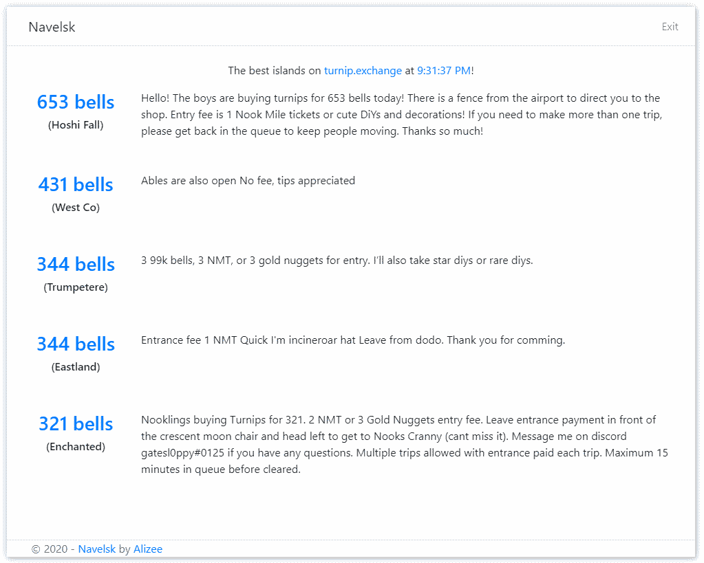

# Navelsk
This program displays the "best" Animal Crossing: New Horizon islands available on https://turnip.exchange.

The displayed islands are the ones with the **best turnip price** and **no queue**.



# How to use
- Go to the [Release page](https://github.com/klejeune/navelsk/releases)
- Download the last Navelsk.x.x.x.exe file
- Double-click the file you just downloaded
- If Microsoft Defender SmartScreen shows you a warning, click on "More info" then "Run anyway"
- Enjoy those sweet 600+ bells islands

Use this program during the week (tuesday-friday), when the prices are the highest on some islands.

Get in the queue quickly on turnip.exchange, because people rush to these high-price islands.

# License
Navelsk uses the MIT license.

 [](https://opensource.org/licenses/MIT)

# Source code
## Technology
This software is built with the following technology:
- [Electron](https://www.electronjs.org/)
- [React](https://reactjs.org/)
- [Webpack](https://webpack.js.org/)

## Commands
### Build
To build Navelsk, use this command line in Powershell:
```
npm run install
npm run build
```

This compiles the source code and stores the result in a "dist" folder.

### Run
To run Navelsk, use this command line in Powershell:
```
npm run start
```

This runs the "build" command then starts the program.

### Package
To generate the Navelsk EXE file, use this command line in Powershell:
```
npm run package
```

